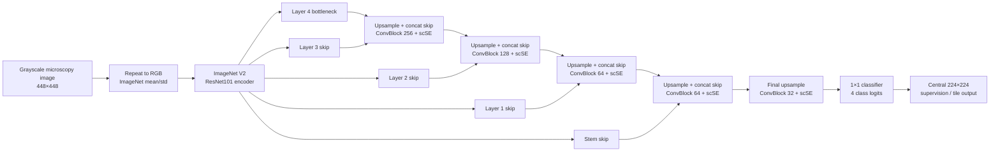

# KoMaP metallographic image segmentation

Experiments on four-class segmentation of optical-microscopy images. The repository contains training/evaluation code, experiment configurations, and a compact record of completed Context448 runs. Dataset images, checkpoints, and prediction masks are intentionally excluded; see [data setup](docs/DATA_AND_REPRODUCIBILITY_KO.md).

## Best supported recipe

R022 is the maintained comparison baseline: ImageNet V2 ResNet101 + U-Net/scSE, 448×448 context input with central 224×224 supervision, balanced rare-phase sampling, CE + weighted Dice + Lovasz loss, and 150 epochs. On the 20-image validation split it scored **0.798969 absent=1 mIoU** and **0.786469 strict mIoU** with D4 test-time augmentation. These are validation results, not official test results.

R031 is the highest observed single checkpoint at 0.799332 D4 absent=1 mIoU (+0.0362 percentage points over R022), but the change did not reproduce on seed 43. R022 therefore remains the default recipe; R031 is retained as an observed-best checkpoint result, not a proven improvement. Full per-run values and caveats are in [experiment results](docs/EXPERIMENT_RESULTS_KO.md).

## Highest observed model: R031

R031 keeps the R022 ResNet101 U-Net/scSE architecture and changes the Dice reduction from batch-pooled to per-tile spatial Dice. The score difference was small and failed the seed-43 comparison, so the diagram describes the highest observed model while R022 remains the supported default.

Training uses the central 224×224 target from each 448×448 context crop. Inference aggregates overlapping central tiles. The decoder uses bilinear upsampling and skip concatenation; each ConvBlock has two Conv-BN-ReLU layers followed by scSE.

## Code map

- Root Python files and `mimu/`: local training, evaluation, and historical experiment implementations.
- `experiments/server_architecture_lab/`: R022-aligned server training code and B/C01–C13 architecture configurations. C01–C13 are **proposals awaiting experiments**, not completed results. C13 replaces only the deepest decoder block with a shared-weight two-step RRCU.
- `docs/`: experiment results, setup/reproducibility notes, and architecture references.

## Quick start

Use the server environment documented in the experiment package, prepare the competition data locally in the required `Data/{train,valid,test}` layout, then follow `experiments/server_architecture_lab/README.md`. No dataset or trained weights are provided by this repository.

## Scope and evaluation

Reported scores use validation images and image-macro mean IoU. Absent-class handling is stated alongside each score. Checkpoint selection uses single-view validation; D4 is evaluated afterward and does not select the checkpoint. R045 was reported as in progress at 3/150 epochs in the source report; its later status and final score have not been verified here.
