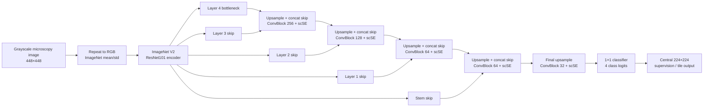

# KoMaP metallographic image segmentation

Experiments on four-class segmentation of optical-microscopy images. The repository contains training/evaluation code, experiment configurations, and a compact record of completed Context448 runs. Dataset images, checkpoints, and prediction masks are intentionally excluded; see [data setup](docs/DATA_AND_REPRODUCIBILITY_KO.md).

## Latest experiment update — 2026-10-08

The 00:22 KST snapshot records **53/103 completed runs** in the current queues. The separate H100 gate suite is **32/32 complete according to the supplied server report**. The ledger has 151 records including historical runs, evaluations and overlapping seed aggregates; it is not a count of independent training runs.

See the [complete Korean summary](docs/experiment_snapshot_20261008/TOTAL_SUMMARY_KO.md), [experiment ledger](docs/experiment_snapshot_20261008/EXPERIMENTS.csv), and [same-seed comparisons with diagnostics and bootstrap intervals](docs/experiment_snapshot_20261008/PAIRED_RESULTS.csv).

| Cohort / change | Paired D4 delta (percentage points) | Evidence |
|---|---:|---|
| H100 CS_CBAM | −0.0012 | 3 seeds; effectively tied with B (mean 79.8202%) |
| Mac contact-weighted CE (D03) | +0.2442 | 3/3 seeds improve |
| Separately reported server D03 | −0.0647 | 1/3 seeds improve; does not reproduce the Mac direction |
| Mac connectivity auxiliary head | +0.3811 | Seed42 only; additional seeds needed |
| L4 U2_CBAM_DEEP | +0.1090 | Seeds42/44 complete; seed43 pending |
| L4 contrast OFF / noise HALF | +0.1707 / +0.1414 | 3/3 seeds improve mIoU, but contact error worsens |
| T4 brightness HALF reproduction | −0.2236 | 2 seeds complete; seed44 in progress |

These deltas compare each cohort with its own same-seed baseline. They must not be pooled across hardware, source versions or evaluation conditions. All scores are validation results. The additional L4 recovery monitor lost its connection; runtime termination has not been confirmed.

The [U-Net + Transformer package](experiments/transformer_hybrid_lab_20261007/README_KO.md) implements HT_BOT, HT_PYR and HT_DEC16, with pretrained Swin-T, matched B controls, fixed optimizer groups, freeze/unfreeze scheduling and checkpoint RNG replay. CPU architecture and interruption/resume checks passed; full-size H100 CUDA checks and real-data hybrid training have not started. Batch4/8/16 profiling is supported; compare B and hybrids at the same selected batch.

[Download the small source-only server ZIP](releases/KoMaP_UNet_Transformer_Code_20261008.zip). Prepare authorized data separately using the [data layout](docs/DATA_AND_REPRODUCIBILITY_KO.md).

## Best supported recipe

R022 is the maintained comparison baseline: ImageNet V2 ResNet101 + U-Net/scSE, 448×448 context input with central 224×224 supervision, balanced rare-phase sampling, CE + weighted Dice + Lovasz loss, and 150 epochs. On the 20-image validation split it scored **0.798969 absent=1 mIoU** and **0.786469 strict mIoU** with D4 test-time augmentation. These are validation results, not official test results.

In the historical R012–R044 report, R031 was the highest observed single checkpoint at 0.799332 D4 absent=1 mIoU (+0.0362 percentage points over R022), but the change did not reproduce on seed 43. R022 therefore remains the default recipe; R031 is retained as an observed-best checkpoint result, not a proven improvement. Full per-run values and caveats are in [experiment results](docs/EXPERIMENT_RESULTS_KO.md).

## Historical R031 architecture

R031 keeps the R022 ResNet101 U-Net/scSE architecture and changes the Dice reduction from batch-pooled to per-tile spatial Dice. The score difference was small and failed the seed-43 comparison, so the diagram describes the highest observed model while R022 remains the supported default.

Training uses the central 224×224 target from each 448×448 context crop. Inference aggregates overlapping central tiles. The decoder uses bilinear upsampling and skip concatenation; each ConvBlock has two Conv-BN-ReLU layers followed by scSE.

## Code map

- Root Python files and `mimu/`: local training, evaluation, and historical experiment implementations.
- `experiments/server_architecture_lab/`: R022-aligned server training code and B/C01–C13 architecture configurations. C01–C12 remain proposals. The initial C13 run was stopped by the user; newer completed RRCU comparisons are listed in the latest experiment summary. See [RRCU experiment](docs/RRCU_EXPERIMENT_KO.md).
- `docs/`: experiment results, setup/reproducibility notes, and architecture references.
- `experiments/r03_augmentation_lab/` and `r03_brightness_reproduction_lab_20261006/`: augmentation controls and cross-environment brightness reproduction.
- `experiments/scse_layer_lab_20261005/`: staged layer/mechanism/spatial gate search associated with the final H100 report.
- `experiments/transformer_hybrid_lab_20261007/`: implemented CNN/Swin and decoder-attention hybrids, CPU checks, batch profiling and server queue.
- `experiments/followup_unet_lab/`: 2026-10-04 follow-up queue: matched B/D03 seeds42–44, reduced no-offset frequency fusion, connectivity auxiliary supervision, PixelShuffle, loss ratios, and AdamW learning rates. Ten tests and all nine configuration preflights passed. The latest snapshot has nine of thirteen follow-up runs complete; scores and remaining work are in the current experiment summary. See [execution protocol](experiments/followup_unet_lab/README_KO.md).

## Quick start

Use the server environment documented in the experiment package, prepare the competition data locally in the required `Data/{train,valid,test}` layout, then follow `experiments/server_architecture_lab/README.md`. No dataset or trained weights are provided by this repository.

## Scope and evaluation

Reported scores use validation images and image-macro mean IoU. Absent-class handling is stated alongside each score. Checkpoint selection uses single-view validation; D4 is evaluated afterward and does not select the checkpoint. R045 was reported as in progress at 3/150 epochs in the source report; its later status and final score have not been verified here.
