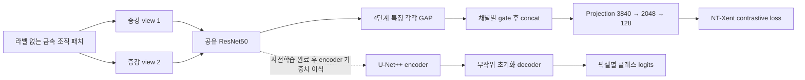

# MatSSL 아키텍처 추출 및 KoMaP 적용 검토

확인일: 2026-10-01. 대상: arXiv:2507.18184v1, 저자 공개 저장소의 현재 `main`, 저장소가 지정한 SMP 0.5.0 코드. 실제 학습·이식은 수행하지 않았다.

## 1. 전체 구성

MatSSL은 두 단계다. **ImageNet ResNet50을 금속 조직 영상으로 contrastive SSL 사전학습 → 해당 encoder를 U-Net++에 옮겨 지도학습**한다. 사전학습의 projection/gating 모듈과 최종 segmentation decoder를 구분해야 한다. [논문 §3](https://arxiv.org/html/2507.18184v1#S3)

구조도의 projection 차원은 공개 모델 코드에서 확인했다. 두 view는 같은 encoder를 공유한다. [MatSSL 모델](https://github.com/aimat-ust/MatSSL/blob/main/utils/models/matSSL.py), [SSL 학습 코드](https://github.com/aimat-ust/MatSSL/blob/main/utils/ssl_trainer.py)

## 2. SSL encoder와 Gated Feature Fusion

| 항목 | 공개 코드에서 확인한 구성 |
|---|---|
| Backbone | ImageNet pretrained ResNet50, fc는 Identity |
| 추출 위치 | layer1 / layer2 / layer3 / layer4 |
| 특징 채널 | 256 / 512 / 1024 / 2048 |
| 공간 축 처리 | 각 특징의 H,W 방향 평균, 즉 GAP |
| Gate 파라미터 | 단계별 `(1,C)` 벡터, 모든 원소 1로 초기화 |
| 실제 연산 | `G_i = sigmoid(P_i) * GAP(X_i)` |
| Fusion | 네 벡터 concat, 총 3840차원 |
| Projection head | Lightly SimCLRProjectionHead, 입력3840 / hidden2048 / 출력128 |

**중요:** gate는 입력마다 생성하는 attention map이 아니라 학습되는 채널별 고정 파라미터다. 공간 좌표를 보존하지 않으며, stage 가중치 하나씩의 scalar gate도 아니다. 코드 기준 gate 추가 파라미터는 `256+512+1024+2048=3840`개이고 초기 gate 값은 `sigmoid(1)≈0.731`이다. projection 내부 세부 BN/activation 구성은 이 조사에서 Lightly 해당 버전 소스까지 확인하지 못했으므로 확정하지 않는다. [모델 코드](https://github.com/aimat-ust/MatSSL/blob/main/utils/models/matSSL.py)

논문 식(1)은 **`G_i = sigmoid(F_i) × P_i`**로 기재되어 코드와 sigmoid 적용 대상이 반대다. 논문식과 저자 코드식은 동치가 아니다. 재현 시 어느 쪽을 따르는지 명시해야 한다. [논문 식(1)](https://arxiv.org/html/2507.18184v1#S3.SS1), [실제 gate 코드](https://github.com/aimat-ust/MatSSL/blob/main/utils/models/matSSL.py)

또한 gate 출력이 다음 ResNet stage의 입력을 대체하는 연결은 없다. layer1→2→3→4는 일반 ResNet 경로이고, 각 stage의 pooled 특징을 SSL head에서 모으는 별도 경로다. 기존 decoder scSE와 역할이 다르다. [forward 구현](https://github.com/aimat-ust/MatSSL/blob/main/utils/models/matSSL.py)

## 3. 분할 모델로 무엇을 옮기는가

저자 fine-tuning 코드는 `smp.UnetPlusPlus(encoder_name="resnet50", in_channels=3, classes=n_classes)`를 생성한다. SSL 사용 시 encoder의 ImageNet 초기화를 끄고 SSL checkpoint를 로드한다. 출력 클래스 수는 데이터셋 설정에 따른다. [분할 모델 생성](https://github.com/aimat-ust/MatSSL/blob/main/train_finetune.py)

checkpoint에서 `backbone.` 키만 추출하고 접두사를 제거해 encoder에 strict loading한다. **gate와 projection head는 최종 분할 모델에 이식하지 않는다.** 따라서 기존 decoder에 GFF를 단순 추가하는 변경은 이 논문의 전체 방법 재현과 다르다. [가중치 이식](https://github.com/aimat-ust/MatSSL/blob/main/utils/finetuning_trainer.py)

저자 코드가 생략한 decoder 인자는 저장소의 SMP 0.5.0 기본값에 의해 정해진다. 아래는 논문 본문에 명시된 새 모듈이 아니라 **사용한 라이브러리의 기본값으로 확인한 내용**이다. [의존성 버전](https://github.com/aimat-ust/MatSSL/blob/main/requirements.txt)

| 구성 | SMP 0.5.0 기본값 |
|---|---|
| Encoder depth | 5 |
| Decoder 채널 설정 | 256 / 128 / 64 / 32 / 16 |
| Decoder normalization | BatchNorm |
| Upsampling | nearest interpolation |
| Decoder attention | None, scSE 없음 |
| Segmentation head | 3×3 convolution, 최종16채널 → 클래스 수 |
| 출력 activation | None, logits |
| Deep supervision | 이 생성 경로는 여러 분할 출력을 만들지 않음 |

[U-Net++ 모델 기본값](https://github.com/qubvel-org/segmentation_models.pytorch/blob/v0.5.0/segmentation_models_pytorch/decoders/unetplusplus/model.py)

decoder block은 upsample → skip concat → 3×3 Conv/Norm/ReLU 두 번으로 구성되며, 여러 중간 decoder 특징을 모으는 nested dense skip 경로를 사용한다. 원본 해상도의 입력 자체를 skip으로 쓰는 경로는 제외된다. [U-Net++ decoder](https://github.com/qubvel-org/segmentation_models.pytorch/blob/v0.5.0/segmentation_models_pytorch/decoders/unetplusplus/decoder.py)

## 4. 재현에 필요한 학습 조건

| 항목 | 논문에 기재된 설정 |
|---|---|
| SSL patch | 256×256 |
| SSL 데이터 규모 | 조합에 따라 29,862 / 32,132 / 46,698 패치 |
| SSL epochs / batch | 50 / 128 |
| SSL optimizer | SGD, LR0.1, momentum0.9, weight decay1e-6 |
| SSL scheduler | cosine, 최종 LR1e-4로 서술 |
| Contrastive loss | NT-Xent, temperature0.07 |
| Segmentation | 전체 encoder+decoder fine-tuning, Dice loss |
| Fine-tuning epochs | MetalDAM/EBC 200, Aachen 50 |
| Fine-tuning optimizer | Adam, LR1e-4, weight decay1e-5로 서술 |
| Seed | 0 |

사전학습 입력은 downstream test에서 제외한 영상으로 구성한다. 논문은 MetalDAM ImageNet baseline 66.73%, MatSSL(Aachen+UHCS) 69.95%를 표4에 보고한다. 초록에는 69.13%로 적혀 수치가 일치하지 않는다. KoMaP와 데이터·평가가 달라 우리의 78.7308%와 직접 순위 비교할 수 없다. [논문 §4 및 표4](https://arxiv.org/html/2507.18184v1#S4)

### 공개 코드와 논문 설정의 차이

| 항목 | 공개 코드에서 확인한 차이 |
|---|---|
| SSL batch | CLI 기본값32, 논문128과 다름 |
| SSL epochs/input | 환경변수 미설정 fallback은 100 epoch / 224 |
| SSL cosine | `eta_min` 미지정이므로 코드 기본0; 논문 최종1e-4와 다름 |
| Fine-tuning Adam | weight_decay 인자 없음, 기본0 |
| 클래스 선택 | `DiceLoss(..., classes=n_classes)`로 integer 전달; 라이브러리 호환성 점검 필요 |
| MetalDAM 클래스 수 | dataset config는5, 논문은4클래스로 서술 |
| Aachen LR | dataset config 기본1e-3, 논문1e-4 |

위 값은 **현재 공개 소스의 기본값**이며 저자 실제 실험의 CLI·환경변수 설정을 입증하지 않는다. 환경 설정과 실제 실행 기록을 확인해야 동일 재현 여부를 판단할 수 있다. [SSL CLI](https://github.com/aimat-ust/MatSSL/blob/main/train_ssl.py), [SSL trainer](https://github.com/aimat-ust/MatSSL/blob/main/utils/ssl_trainer.py), [Fine-tuning trainer](https://github.com/aimat-ust/MatSSL/blob/main/utils/finetuning_trainer.py), [데이터 설정](https://github.com/aimat-ust/MatSSL/blob/main/utils/data_processing/finetune_dataset.py)

SSL 증강 공개 코드: 먼저 지정 크기로 resize, random resized crop(scale0.2~1), color jitter(p0.8, brightness/contrast/saturation0.4, hue0.1), grayscale(p0.2), Gaussian blur(p0.5, sigma0.1~2), horizontal flip(p0.5), ImageNet RGB normalization. 논문의 color jitter ±0.1 서술과 다르다. KoMaP grayscale에서는 saturation/hue의 의미가 작고, blur/crop이 얇은 조직을 지울 가능성은 별도로 검증할 가설이다. [증강 구현](https://github.com/aimat-ust/MatSSL/blob/main/utils/data_processing/ssl_dataset.py)

평가 코드는 union=0을 IoU=0으로 처리하고 **MetalDAM에서는 class3을 mean IoU에서 제외**한다. trainer는 batch별 IoU를 균등 평균한다. MetalDAM/Aachen에서는 test loader를 매 epoch 평가하고 best 저장에 사용하며 EBC 기본은 val이다. 따라서 원본 코드를 그대로 가져오기보다 우리의 Valid20 이미지 평균·4클래스·absent=one 기준을 유지해야 비교 가능하다. [평가 함수](https://github.com/aimat-ust/MatSSL/blob/main/utils/evaluations/evaluate.py), [best 선택](https://github.com/aimat-ust/MatSSL/blob/main/utils/finetuning_trainer.py), [분할 선택](https://github.com/aimat-ust/MatSSL/blob/main/utils/data_processing/finetune_dataset.py)

## 5. 현재 KoMaP 모델에서 가져올 부분 — 적용 제안

아래는 저자의 실험 결과가 아니라, 현재 프로젝트에 대한 적용 판단이다.

**우선순위 1: encoder의 금속 조직 도메인 사전학습 효과를 분리한다.** 같은 ResNet50 encoder의 ImageNet 초기화와 저자 공개 MatSSL 초기화를 비교하고 decoder·sampling·loss·epoch·평가는 맞춘다. 공개 pretrained encoder는 저장소 README에 링크돼 있다. 다운로드 및 checkpoint shape 검증은 이번 조사에서 하지 않았다. [저자 Model Hub 안내](https://github.com/aimat-ust/MatSSL#model-hub)

**우선순위 2: 기존 ResNet34에서도 multi-stage SSL을 비교한다.** 현재 layer1~4 채널은64/128/256/512이므로 concat은960차원이다. 이는 코드에 맞춰 변경한 파생 실험이며 원 논문 구조 재현은 아니다. encoder→GAP→gate→projection을 사전학습에만 붙이고, 이후 기존 U-Net+scSE(+DySample) 구조에서 encoder 초기화만 비교한다.

**우선순위 3: U-Net++ decoder 자체는 별도 비교한다.** nested skip의 효과를 확인하려면 SSL과 decoder 변경을 동시에 시작하지 않는다. 계산량과 메모리 사용량은 실제 장치에서 측정해야 한다.

실행 전 확인할 점:

- 공개 ResNet50 가중치는 현재 ResNet34에 직접 strict loading할 수 없다. backbone을 맞추거나 별도 ResNet34 SSL이 필요하다.
- 원 구현은 RGB3채널이다. KoMaP 입력을 3채널 반복하거나 첫 conv 가중치를 합산한1채널로 바꾸는 선택을 기록하고, 그 방식에 맞는 정규화를 사용한다.
- Train70에서 SSL을 한다면 Valid/Test 영상은 사전학습에서도 제외한다. 외부 영상은 split 중복을 확인한다.
- 현재 supervised batch4를 SSL batch128과 동등하게 보지 않는다. 일반적인 gradient accumulation만으로 각 microbatch의 contrastive negative pool이128로 늘어나지는 않는다.
- GFF는 GAP 뒤에 있으므로 얇은 구조의 공간 복원을 직접 담당하지 않는다. 도메인 표현 개선이 Eutectic 혼동을 줄이는지는 실험으로 확인해야 한다.
- 원 저장소 trainer에는 기존 실험 폴더를 삭제하는 경로가 있다. 이 프로젝트에는 그대로 실행하지 않고 출력 보존·resume·기존 평가 정책을 유지하는 별도 runner를 준비해야 한다.

**추출 결론:** 가장 유용한 아이디어는 **여러 encoder stage를 SSL loss에 참여시킨 도메인 사전학습**이다. 공간 attention/scSE 대체나 decoder gate 추가만으로 MatSSL을 재현했다고 표현하면 부정확하다.
