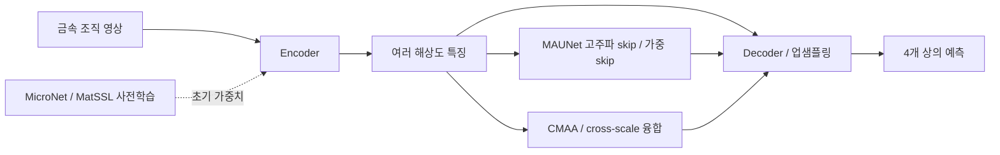

# 금속 조직 분할 모델: 아키텍처와 노벨티 분석

확인일: 2026-10-01. 기존 논문 목록 14편의 기여를 구조·학습·후처리·응용으로 구분했다. 아래 ID로 이후 실험을 지정할 수 있다. 이 문서는 조사와 제안이며 새 학습을 시작하지 않았다.

‘노벨티’는 저자의 기여와 확인된 차별점을 뜻한다. 전체 선행연구를 망라한 최초성 판정은 아니다. **논문에서 확인한 구조**와 **우리 모델에 적용할 가설**을 구분했다. 구조의 복잡함과 실제 성능 개선은 별개다.

기준 상황: 로컬 모델은 ResNet34 U-Net + decoder scSE + DySample이다. 팀원이 전달한 최고 결과는 R022 ResNet101, 0.798969이며 상세 설정은 미확인이다. 따라서 R022에 동일한 decoder가 쓰였다고 가정하지 않는다.

## 한눈에 보는 변경 위치

| ID | 후보 | 주된 변경 위치 | 핵심 차별점 | 현재 모델에 일부 이식 |
| --- | --- | --- | --- | --- |
| N01 | CMAA-Net | encoder/decoder attention | 적응 다중 스케일 attention과 채널 관계 모델링 | 가능, 정확한 모듈 설계 추가 확인 |
| N02 | CS-UNet | encoder와 decoder | CNN/Swin 병렬 특징을 여러 decoder 단계에서 융합 | 전체 교체 또는 단순화한 파생 구조 |
| N03 | SegFormer + cross-attention | 특징 융합 | 인접한 해상도 사이의 정보 선택·전달 | 가능, 원 모델은 SegFormer B5 |
| N04 | MFF-UMamba | encoder/decoder/skip/학습 | VSS + 가중 융합 + 얕은·깊은 출력 보조 학습 | 융합·보조 head는 분리 가능 |
| N05 | Ni-WC Transformer 비교 논문 | 비교 연구 | 기존 여러 구조의 금속 SEM 적합성 평가 | 아래 비교 모델 표 참조 |
| N06 | MicroNet | encoder 초기 가중치 | 현미경 데이터로 지도 사전학습 | 같은 backbone의 가중치 교체 |
| N07 | Attention U-Net ensemble | skip와 ensemble | LSTM 채널 attention·공간 attention·색 공간별 모델 결합 | attention/dilation만 분리 가능 |
| N08 | MAUNet / SASAPD | skip/decoder 또는 검출 학습 | 고주파 전달 / 어려운 anchor point 재가중 | MAUNet의 skip 아이디어 가능 |
| N09 | SAMM | foundation model와 학습 | 재료용 SAM2 전체 미세조정·스케일 융합 | 상세 head와 fusion 확인 필요 |
| N10 | MatSAM | prompt와 후처리 | 미세조직 배치에 맞춘 자동 point 생성 | 별도 영역 추출 파이프라인 |
| N11 | MIMU-Net | encoder/attention/decoder | recurrent residual + scSE + feature pyramid 조합 | feature pyramid 등 분리 가능 |
| N12 | MatSSL | SSL 사전학습 head | 여러 stage 특징을 gate로 조절해 SSL에 참여 | 기존 encoder 학습에 사용 가능 |
| N13 | SAM-I-Am | mask 후처리 | 기하 필터링 + 텍스처 기반 mask 병합 | 텍스처 후처리 아이디어 |
| N14 | Cellpose-SAM 결정립 분석 | 출력 표현·응용 | flow 기반 instance 분할을 결정립 계측에 적용 | 상 분류와 다른 출력·라벨 필요 |

표의 이식 가능성은 설계 판단이며 실행 검증 결과가 아니다.

## N01. CMAA-Net: 조직마다 유용한 스케일·채널을 선택

**확인한 구조:** U-Net 계열 → APAM을 포함한 특징 추출 → 다중 dilation과 적응 attention head → 채널 관계 LSTM → APAM decoder. 출판사 공개 발췌에서 확인했다.

**노벨티 해석:** 중요한 채널을 강조하는 것에 더해, 크기가 다른 패턴을 처리하고 attention head 중요도를 조절하는 조합이다. **채널 LSTM 자체는 N07에도 존재한다.** CMAA의 차별점을 LSTM을 처음 도입했다는 주장으로 설명하면 부정확하다. [CMAA 논문](https://doi.org/10.1016/j.eswa.2025.126925), [2023년 선행 모델](https://pmc.ncbi.nlm.nih.gov/articles/PMC10081997/)

**우리 적용 가설:** Eutectic Si와 주변 상의 비슷한 텍스처를 여러 크기로 비교한다. scSE를 대체하는 모듈 후보로 볼 수 있다. APAM 내부 연산·채널 순서·dilation 값은 미확인이라 전체 재현 설계는 아직 확정할 수 없다.

**분리할 변경:** multi-scale dilation → 적응 fusion → 채널 관계 학습. 한꺼번에 붙이면 개선 원인을 알기 어렵다.

## N02. CS-UNet: 국소 특징과 문맥을 병렬로 얻어 복원 단계마다 연결

**확인한 구조:** 이미지가 CNN과 Swin encoder에 병렬 입력된다. 저자 decoder 코드는 깊은 단계에서 CNN/Swin 특징을 concat하고, 이후에는 decoder·Swin skip·CNN skip을 concat한 뒤 Linear로 채널을 줄인다. patch expansion으로 복원한다. [저자 decoder 코드](https://github.com/Kalrfou/SwinT-pretrained-microscopy-models/blob/main/networks/CSUnetDecoder.py)

**노벨티 해석:** 두 경로를 마지막에만 결합하는 방식보다, 여러 복원 단계에서 CNN의 세부 특징과 Swin의 문맥을 함께 사용한다. 현미경 사전학습과 ResMLP 변경도 연구의 구성 요소다. ResMLP는 논문에서 확인했으며 구현 일치 여부는 별도 확인 대상이다. [본문 §III-C](https://arxiv.org/html/2308.13917#S3.SS3)

**우리 적용 가설:** 넓은 문맥이 필요한 상 구분과 얇은 경계를 함께 처리한다. 작은 Transformer 가지 추가는 가능한 파생 설계지만 CS-UNet 재현과는 다르다. 구조 효과와 MicroLite/MicroNet 사전학습 효과를 분리해야 한다.

## N03. SegFormer + cross-attention: 다른 스케일을 합치기 전에 서로 참조

**확인한 구조:** SegFormer B5의 F4/F8/F16/F32 → 인접 stage 3쌍의 해상도·채널 정렬 → Q/K/V cross-attention → concat → 분할 head. [논문 §III](https://jicrs.icros.org/_PR/view/?aidx=47232&bidx=4265)

**노벨티 해석:** SegFormer 자체는 기존 모델이다. 새 기여는 **인접한 스케일 사이에 내용에 따른 상호 참조를 넣는 방식**이다. 단순 concat은 특징을 나란히 전달하지만 cross-attention은 다른 스케일에서 관련된 정보를 선택한다. 모든 stage 조합을 계산하지 않는 설계도 포함한다.

**우리 적용 가설:** 작은 Eutectic 패턴을 주변 조직의 문맥과 연결한다. CNN feature pyramid에도 원리를 적용할 수 있지만 원 논문과 다른 변형이다. 우선 낮은 해상도 두 stage만 연결하는 선택은 우리 계산량을 위한 제안이다. 해상도 정렬 후 공간 attention 구현은 위치 수에 따라 메모리 비용이 커질 수 있다.

## N04. MFF-UMamba: Mamba 외에 skip 융합과 보조 학습도 기여

**확인한 구조:** VMamba-T/VSS 기반 추출·복원, W-PSB 융합, SFRB/DFAB를 통한 얕은·깊은 출력 학습이다. W-PSB 식은 채널을 맞춘 shallow/deep 특징의 `α×shallow + β×deep`을 Conv/BN/ReLU로 처리한다. 본문에서 α·β는 학습되는 scalar이며 입력별 gate 생성으로 단정할 수 없다. [본문 §3](https://academic.oup.com/cdm/advance-article/doi/10.1093/cdm/wqag018/8711488)

**노벨티 해석:** 기존 Mamba/SS2D를 활용하면서 가중 feature fusion과 학습 보조 모듈을 결합한 설계다. 새 Mamba 원리를 발명한 논문으로 해석하지 않는다.

**우리 적용 가설:** 전체 Mamba 교체 없이 skip 가중 융합이나 중간 분할 head를 차용할 수 있다. 원 논문은 이진 과제이므로 4개 상에 맞춰 head·loss를 바꿔야 한다. Mamba 연산은 MPS 실행 검증이 필요하다.

## N05. Ni-WC Transformer 비교 연구: 새 구조 발명과 재료 응용을 구분

이 논문 자체의 기여는 **동일한 금속 SEM 과제에서 여러 기존 구조를 비교하고 조직별 오분류를 분석한 것**이다. 아래 구조들의 원래 노벨티는 각각의 원 논문에 귀속된다. [금속 SEM 비교 논문](https://www.sciencedirect.com/science/article/abs/pii/S1044580325009349)

| 선택 ID | 모델 | 구조를 뜯어보면 | 원 논문의 핵심 기여 | 우리 과제에서의 판단 |
| --- | --- | --- | --- | --- |
| N05a | SegFormer | 계층형 MiT → 여러 stage를 MLP로 융합 | 고정 positional encoding 없이 Mix-FFN에 공간 정보 반영, 단순 decoder | 작은 모델로 문맥 표현을 비교하기 좋음 |
| N05b | UPerNet | 최심층 PPM → FPN top-down → 다중 해상도 융합 | 장면·객체·부분·재질 등 다양한 수준의 정보를 공동 해석 | ResNet101 encoder를 유지하며 decoder 비교 가능 |
| N05c | MaskFormer | pixel embedding + query → mask와 mask class | 픽셀별 분류를 mask 집합의 분류로 재정식화 | 출력·loss·matching까지 변경하는 실험 |
| N05d | Mask2Former | 다중 스케일 pixel decoder + query decoder | 예상 mask 영역으로 cross-attention을 제한 | 구조 전체의 비용·학습 안정성 확인 필요 |
| N05e | DPT | ViT 여러 layer token → Reassemble → CNN fusion | 같은 token 해상도의 여러 깊이 특징을 영상 pyramid로 재구성 | 문맥 표현과 복원 전략을 함께 변경 |
| N05f | SETR | patch sequence → ViT → Naïve/PUP/MLA decoder | CNN의 반복 downsampling 대신 sequence-to-sequence 분할 | 작은 조직을 보존하는 patch·복원 설계 확인 필요 |
| N05g | Segmenter | ViT patch token + class embedding → mask Transformer | patch/class embedding 관계로 class mask 생성 | MaskFormer의 query 집합 예측과 구분 필요 |
| N05h | DeepLabV3+ | dilated backbone/ASPP → 얕은 특징을 이용한 decoder | 다중 수용영역과 경계 복원을 결합, separable conv 활용 | 기존 ResNet 계열에서 다중 스케일 decoder 비교 가능 |

원 출처: [SegFormer](https://arxiv.org/html/2105.15203v3), [UPerNet](https://arxiv.org/html/1807.10221v1), [MaskFormer](https://arxiv.org/abs/2107.06278), [Mask2Former](https://arxiv.org/abs/2112.01527), [DPT](https://arxiv.org/html/2103.13413v1), [SETR](https://arxiv.org/html/2012.15840v3), [Segmenter](https://arxiv.org/abs/2105.05633), [DeepLabV3+](https://arxiv.org/abs/1802.02611).

각 모델의 기본 요소는 기존 연구에서 빌려온 부분도 있다. 예를 들어 UPerNet의 PPM/FPN 각각이 그 논문에서 처음 발명된 것은 아니다. 위 표는 구조상 차이와 연구의 주된 기여를 설명한다.

## N06. MicroNet: 구조보다 encoder가 학습한 영상의 종류를 변경

**확인한 구조:** 현미경 영상의 이미지 분류로 CNN 사전학습 → classification head 제거 → segmentation encoder로 전이. [NASA 연구](https://ntrs.nasa.gov/api/citations/20210026119/downloads/TM-20210026119.pdf)

**노벨티 해석:** 새 ResNet·새 decoder를 발명한 것이 아니라, 재료 도메인의 특징을 학습한 공개 encoder와 이를 검증한 연구다. MatSSL과 달리 사전학습 단계에 이미지 클래스 라벨을 사용한다.

**우리 적용 가설:** 전체 구조를 유지하고 상의 텍스처 표현을 바꾼다. ResNet34와 ResNet101의 가중치가 목록에 있어 현재 모델·R022와 같은 backbone 안에서 비교할 수 있다. [공식 목록](https://github.com/nasa/pretrained-microscopy-models)

**분리할 변경:** ImageNet vs ImageNet→MicroNet 초기화. 입력 채널 변환·정규화·가중치 버전을 확인한다. 구조 변경 없이 사전학습의 필요성을 검토할 선택지다.

## N07. Attention U-Net ensemble: skip 안의 채널 관계와 여러 표현의 합의

**확인한 구조:** dilation 4→3→2→1 encoder, skip에서 채널 attention 뒤 공간 attention, RGB/HSV/YUV 모델 결과의 sum-rule ensemble. 채널 attention은 average/max pooling과 Conv1D·LSTM을 이용한다. [방법 본문](https://pmc.ncbi.nlm.nih.gov/articles/PMC10081997/)

**노벨티 해석:** 단순 SE를 추가한 모델보다 채널 관계 학습과 색 공간별 모델 결합이 특징이다. LSTM이 temporal image sequence를 학습한다는 뜻은 아니다.

**우리 적용 가설:** grayscale에서는 색 공간 ensemble의 정보 다양성이 제한적이다. skip attention과 dilation은 별도로 볼 수 있다. scSE와 attention 중복도 확인한다.

**코드 확인:** 저자 `attention.py`에 `build/call`이 `__init__` 내부에 정의된 들여쓰기 등 실행 전 수정·검증이 필요한 부분이 있다. 공개 여부만으로 즉시 재현 가능한 코드라고 판단할 수 없다. [저자 코드](https://github.com/mb16biswas/attention-unet/blob/main/utils/unet/attention.py)

## N08. MAUNet / SASAPD: 경계 정보 전달과 검출 sample 선택은 별개

**MAUNet 구조:** frequency-aware encoder(FAE)에서 저주파·고주파 전달을 구분하고, skip으로 경계·텍스처 정보를 보내며 decoder에는 dual-path spatial/channel attention을 사용한다.

**노벨티 해석:** 일반 skip의 내용 자체를 바꿔, 저주파 중복과 경계 평활화를 줄이려는 설계다. **FAE와 decoder attention은 서로 다른 기여**다. [논문 §3.1](https://pmc.ncbi.nlm.nih.gov/articles/PMC7796035/)

**우리 적용 가설:** 얇은 Eutectic Si가 소실되는 문제와 연결된다. 우선 얕은 skip의 경계 정보 전달만 분리할 수 있다. 고주파는 촬영 noise도 강조할 수 있어 recall과 오검출을 함께 확인할 가설이다. 정확한 필터 구현은 아직 확정하지 않았다.

**SASAPD:** 어려운 anchor point 재가중과 pyramid feature 선택이 핵심인 검출 모델이다. 4상 semantic segmentation을 그대로 대체하지 않는다. 저자 링크는 확인했지만 현재 저장소에는 README만 있다. [저자 저장소](https://github.com/ZhangYuewan/Metallographic-Image-Analysis)

## N09. SAMM: SAM2를 재료 도메인에 맞추고 세부 구조를 보완

**확인한 구조:** SAM2 전체 파라미터 미세조정 + cross-scale feature fusion + 픽셀·구조 정확도를 고려한 hybrid loss. 이번 확인 범위는 초록이다. [출판사 논문](https://doi.org/10.1016/j.apmate.2026.100404)

**노벨티 해석:** 기존 SAM2와 다양한 재료 데이터에 대한 적응, 스케일 융합·loss를 결합한 접근이다. SAM2 자체를 새로 제안한 것은 아니다.

**우리 적용 가설:** 재료·촬영 조건 변화에 대응하는 표현이 필요할 때 검토한다. fusion 내부 구조, loss 항·가중치, 자동 4클래스 head와 prompt 방식, 배포 가중치는 미확인이다. 따라서 다른 후보처럼 정확한 모듈 단위 이식 설계를 확정할 근거는 아직 부족하다. 초록의 ‘구조 보존’을 topology loss나 boundary loss의 특정 수식으로 해석하지 않았다.

## N10. MatSAM: 모델을 다시 학습하기보다 prompt를 미세조직에 맞춤

**확인한 구조:** 전통적 threshold/edge로 대략적인 영역 생성 → 영역 중심점과 grid point 조합 → 영상 가장자리 prompt 보강 → SAM mask 및 중복 처리. 사전 공개본은 soft-NMS도 설명한다. [사전 공개본 방법](https://arxiv.org/html/2401.05638v1)

**노벨티 해석:** SAM backbone을 바꾸기보다 prompt를 조직의 위치·밀도에 맞추는 전략이 핵심이다. 2025 저널본과 2024 버전의 상세 구현은 구분해야 한다.

**우리 적용 가설:** 영역 후보 생성·사전 라벨링에 적합하다. 예측 mask를 네 상의 이름에 대응시키는 처리가 추가로 필요하다. 중심점 생성이 얇고 연결된 조직에 적합한지도 별도 가설이다. [공식 코드](https://github.com/USTB-AI3DVIP/matsam)

## N11. MIMU-Net: recurrent residual·scSE·feature pyramid의 조합

**확인한 구조:** recurrent residual encoder → scSE로 위치·채널 중요도 조절 → feature pyramid decoder로 여러 크기의 특징 복원. [논문](https://doi.org/10.1016/j.commatsci.2024.113199)

**노벨티 해석:** 각각의 기법을 새로 발명한 것보다, 금속 조직에 맞춰 결합한 U-Net 설계가 기여다. 공간 recurrent convolution을 영상 시퀀스 LSTM이나 전역 attention과 혼동하면 안 된다.

**우리 적용 가설:** 현재 scSE가 있어 추가 attention의 중복보다 decoder pyramid를 분리해 볼 수 있다. 전체 scratch recurrent encoder 교체와 pyramid 추가는 다른 선택지다. [저자 모델 코드](https://github.com/sammajum706/Feature-Pyramid-Recurrent-Residual-U-Net-for-Metallographic-Image-Segmentation/blob/master/fpn_r2unet.py)

## N12. MatSSL: SSL의 학습 신호를 여러 encoder 단계에 전달

**확인한 구조:** encoder 4개 stage → 각각 GAP → 채널 gate → concat → projection → contrastive loss. 이후 encoder만 분할 모델에 전이하며 gate/projection은 제거한다. [저자 코드](https://github.com/aimat-ust/MatSSL/blob/main/utils/models/matSSL.py)

**노벨티 해석:** 최종 stage 하나만 사용하던 SSL에 얕은 텍스처 단계도 참여시키는 gated fusion이 핵심 구조 차이다. U-Net++는 기존 decoder다. GFF가 분할 단계에서 픽셀 경계를 직접 복원하는 모듈은 아니다. [논문](https://arxiv.org/html/2507.18184v1), [U-Net++ 원 논문](https://arxiv.org/abs/1807.10165)

**우리 적용 가설:** 최종 stage SSL → multi-stage concat → gate 추가로 분리한다. 현재 실험은 첫 단계에 해당한다. 코드 gate는 `sigmoid(학습 파라미터)×특징`이며 입력별 attention이 아니다. 논문식과 코드식 차이는 기존 MatSSL 분석 문서에 기록했다.

## N13. SAM-I-Am: 생성 mask에 텍스처의 의미를 붙여 재정리

**확인한 구조:** SAM mask → 면적·중첩·포함 관계로 불필요 mask 제거 → mask 내부 crop의 pretrained texture 특징 → KMeans → 비슷한 microstructure의 mask 병합. [본문 §3.3](https://arxiv.org/html/2404.06638v1)

**노벨티 해석:** SAM의 일반적인 IoU 기반 중복 제거에 더해, 내부 atomic texture의 유사성으로 mask 집합을 정리한다. 새로운 SAM backbone이 아니라 semantic booster 후처리다.

**우리 적용 가설:** 상이 같은데 분리된 영역들을 텍스처로 묶는 아이디어다. 원자 규모 TEM과 우리 금속 조직 영상의 특징이 다르고, cluster ID가 네 상의 class ID에 자동 대응하지 않는다. 작은 mask 제거 규칙은 희귀 조직에 그대로 가져오면 안 된다.

## N14. Cellpose-SAM 결정립 분석: 영역 mask 대신 픽셀의 이동 방향을 예측

**확인한 구조:** SAM image encoder → 가로/세로 flow와 foreground 확률 → flow tracking으로 비중첩 instance mask → 결정립 계측. SAM의 prompt decoder는 사용하지 않는다. [본문 §3.3](https://arxiv.org/html/2604.18957v1)

**노벨티 해석:** flow를 예측하는 Cellpose-SAM 자체는 기존 구조다. 이 금속 논문의 기여는 결정립 라벨·미세조정·후처리를 계측 파이프라인과 연결한 응용이다. 새 topology-aware loss를 발명했다고 설명하지 않는다.

**우리 적용 가설:** 개별 결정립·입자 분리와 개수·크기가 중요할 때 선택한다. 같은 상이 연결된 Eutectic network에는 instance 중심 표현이 자연스러운지 확인이 필요하다. 네 상 분류용 head 또는 별도 분류 단계도 필요하다.

## 서로 비슷해 보여도 다른 세 가지

| 메커니즘 | 선택하는 대상 | 공간 위치 보존 | 주된 사용 단계 |
| --- | --- | --- | --- |
| scSE / 채널·공간 attention | 현재 feature map의 위치·채널 중요도 | 유지 | 분할 encoder/decoder |
| Cross-scale attention | 다른 해상도에서 가져올 특징 | 유지 | stage fusion |
| MatSSL GFF | GAP 후 여러 stage의 채널 표현 | GAP에서 공간 축 제거 | SSL 사전학습 |

따라서 attention이라는 명칭만 보고 서로 대체하면 안 된다. DySample은 업샘플링 때 **어디서 값을 읽어 복원할지**를 학습하는 기존 로컬 변경이다. skip 개선·스케일 융합·encoder 사전학습과는 개입 위치가 다르다. 이들은 함께 쓸 수도 있지만 성능 기여는 별도 비교해야 한다.

위 그림은 **선택 가능한 개입 위치**를 보여주는 개념도다. 모든 후보를 한 모델에 넣은 논문 구조나 구현 계획이 아니다.

## 증상별 선택 기준 — 우리 과제에 대한 가설

| 지금 해결하고 싶은 문제 | 검토할 요소 | 선택했을 때 바뀌는 것 |
| --- | --- | --- |
| 가는 Eutectic Si가 지워지거나 경계가 뭉개짐 | N08 고주파 skip | 얕은 경계 특징을 decoder에 전달하는 경로 |
| 크기에 따라 동일한 상을 다르게 예측 | N01 다중 스케일 선택, N03 cross-attention | 서로 다른 크기의 특징을 결합하는 방식 |
| 주변 배치·문맥이 있어야 상을 구분 | N02 CNN+Swin, N05a SegFormer | 문맥을 표현하는 encoder 경로 |
| 도메인 텍스처를 충분히 학습하지 못함 | N06 MicroNet, N12 multi-stage SSL | 사전학습과 초기 encoder 가중치 |
| 얕은 skip과 깊은 특징의 결합이 불안정 | N04 W-PSB, N05b UPerNet | decoder의 feature fusion |
| 여러 재료·촬영 조건으로 일반화 필요 | N09 SAMM, N06 도메인 사전학습 | 사전학습 범위·전이 방식 |
| 개별 결정립/입자 개수·크기까지 필요 | N14 flow 기반 instance 분할 | 출력 표현·라벨·계측 단계 |

위 증상은 기존 결과 전체를 새로 분석해 확정한 원인이 아니다. 사용자가 해결하고 싶은 문제에 따라 후보를 선택하기 위한 대응표다.

R022가 ResNet101로 가장 높았고 ResNet152가 더 낮았다는 전달 결과만으로 용량 한계가 해결됐다고 단정할 수는 없다. 다만 다음 변경을 더 큰 backbone에만 한정하지 않고, 사전학습·skip·feature fusion으로 나누어 검토할 근거가 된다.

## 재현 준비 수준

| 확인 수준 | 후보 |
| --- | --- |
| 본문 및 일부 저자 코드 확인 | CS-UNet, MatSSL, Attention U-Net |
| 본문 구조·수식 확인 | SegFormer cross-attention, MFF-UMamba, MatSAM 사전 공개본, SAM-I-Am, Cellpose-SAM 응용, 비교 모델 원 논문 |
| 본문 발췌·배포 목록 확인 | MAUNet, MicroNet, MIMU-Net |
| 초록·공개 발췌 수준으로 내부 재현 설계 미완료 | CMAA-Net, SAMM |

MFF-UMamba는 이번에 본문을 추가 확인했으므로 이전 목록의 ‘초록 수준’보다 확인 범위가 넓어졌다. 후보들의 MPS 실행·성능은 이번 조사에서 검증하지 않았다. 새 실험은 사용자가 선택한 ID와 적용 범위에 맞춰 별도로 구성한다.
